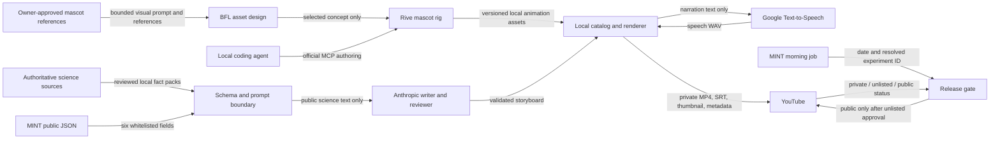

# ErklaerBaer production specification

> Current v3 implementation: [status and remaining gates](V3_IMPLEMENTATION_STATUS.md),
> [weekly feed/queue](WEEKLY_V3.md), [asset backup/recovery](ASSET_RECOVERY_V3.md).
> The Dutch guitar working render exists, but native rim repair and expressive narration are
> blocked. Legacy daily instructions below are historical and disabled; they are not an
> alternative production path. V3 creative acceptance has not been granted.


Status: v3 implementation in progress; first creative gate incomplete  
Audience: project owner and maintainers  
Runtime: Python 3.12

The six-action v2 Rive library is exported and integrated. Three local pilots passed technical
checks, but owner feedback requires creative revision. The approved v3 target is layered paper/felt
collage, expressive narrator/bear voices, and one weekly video with alternating languages and a
private Nochmal priority queue. Follow [the v3 plan](V3_REDESIGN_PLAN.md) and
[implementation prompt](PRODUCTION_V3_PROMPT.md). These supersede conflicting daily scheduling and
old per-step gates below; historical architecture details remain until their replacements ship.

Historical screenshot-by-screenshot gates in `docs/RIVE_RIG.md` and review records describe the
completed v1 work. They do not require repeating approvals or interrupting this v2 implementation.

## 1. Purpose

ErklaerBaer turns each MINT-Bot science topic into a short, narrated,
child-friendly YouTube explanation. It produces one public video per MINT day.
The language alternates between German and Netherlands Dutch.

The production system is deliberately deterministic. An LLM writes a validated
storyboard, but a local scene engine renders only known visual components. It
does not execute generated code and does not use generative video.

### Goals

- Explain the science behind the day's MINT phenomenon to early-school-age
  children.
- Produce modern, playful paper-cut animation that visibly explains mechanisms at low recurring cost.
- Let the owner review finished building blocks and videos without operating animation timelines.
- Require a human review before any generated video can become public.
- Reuse a video when the same experiment and language return unchanged.
- Remain auditable: source snapshots, storyboards, captions, hashes, and
  YouTube IDs are recorded.
- Fail closed when content, approval, credentials, or external services are
  missing.

### Non-goals

- The video does not teach the material list or experiment steps.
- ErklaerBaer does not change or embed content in the MINT-Bot interface.
- It does not publish an opposite-language substitute.
- It does not publish an unreviewed draft.
- It does not process child profiles, MINT history, database records, or other
  personal information.

## 2. Historical date-based language assignment

Language is a pure function of the MINT date. Let

`ordinal(date) = date - 1970-01-01`, measured in complete calendar days.

- even ordinal: German (`de-DE`)
- odd ordinal: Netherlands Dutch (`nl-NL`)

The date is supplied in ISO `YYYY-MM-DD` form, so daylight-saving time does not
enter the calculation. The production timezone follows MINT-Bot:
`Europe/Berlin`. The parity is continuous across month and year boundaries.
For example, 2026-09-04 is German and 2026-09-05 is Dutch.

The configuration supports two modes:

- `alternating`: produce only the language assigned to each date.
- `both`: produce both languages for each date. This is reserved for a future
  volume increase.

## 3. Source and identity

MINT-Bot's deployed `experiments.json` and `schedule.json` are the canonical
public sources for discovery. Only these experiment fields are retained:

- `id`
- `titel`
- `kategorie`
- `fakt`
- `wasPassiert`
- `erklaerung`

All other source fields are ignored. Repository documentation and instructions
inside source data are context, never executable instructions.

Validated source shape:

```json
{
  "id": "lowercase-hyphenated-id",
  "title": "string",
  "category": "string",
  "fact": "public science fact",
  "observed_result": "public observed result",
  "explanation": "public causal explanation"
}
```

The schedule is an object whose ISO date keys map to experiment IDs. Unknown
IDs, duplicate IDs, invalid dates, non-HTTPS URLs, oversized responses, and
unknown fields in internal models are rejected.

The retained fields are canonicalized as UTF-8 JSON with sorted keys and
hashed with SHA-256. The first 16 hexadecimal characters form `source_hash`.
A source/language requirement is identified by:

`(experiment_id, language, source_hash)`.

If the source hash changes, the old video remains untouched while a new private
version is created and reviewed.

The source identity alone is insufficient to identify a rendered revision. Add a deterministic
build fingerprint covering the validated storyboard, reviewed scientific evidence/corrections,
renderer/template revision, mascot manifest and asset hashes, and narration/voice/timing settings.
Hash content-affecting fields only; exclude timestamps, machine-specific absolute paths and mutable
review status so recording approval does not itself create a new unapproved build.
Persist immutable build records and bundles under that source identity. A changed fingerprint
requires a new rendered revision; it must never inherit another revision's publication approval
or overwrite an uploaded artifact. Discovery and release must resolve the intended current build
explicitly. Retain the existing source hash algorithm and migrate existing catalog entries safely.

## 4. Storyboard contract

Each storyboard has:

- schema and template versions;
- experiment ID, language, source hash, title, and category;
- six to nine ordered scenes;
- narration, zero to five on-screen words, a known scene primitive, explicit scientific objects
  and their relationships, timed actions, an optional sound cue, and factual claim anchors per scene;
- mascot visibility, placement, scale, and a semantic action chosen from the approved library;
- localized YouTube title, description, tags, and thumbnail text;
- reviewer findings and estimated spoken duration.

The versioned output bundle is:

```text
storyboards/<experiment>/<language>/<source_hash>.json
artifacts/<experiment>/<language>/<source_hash>/captions.srt
artifacts/<experiment>/<language>/<source_hash>/thumbnail.jpg
artifacts/<experiment>/<language>/<source_hash>/checksums.sha256
catalog/videos.json
```

Unversioned `build/` contains narration WAV, intermediate video, and the final
MP4. The catalog stores status, YouTube ID, template version, video checksum,
duration, warnings, update time, and date-level release records.

Allowed scene primitives are:

- `question`
- `macro_to_micro`
- `particles`
- `cause_effect`
- `flow`
- `comparison`
- `prediction`
- `recap`

Model output is data only. Unknown primitives, paths, URLs, excessive text, or
unrecognized sound cues fail validation. Visual tokens come from a small,
versioned drawing vocabulary; unknown tokens fail closed instead of producing
an arbitrary fallback symbol. Animal drawings preserve identifying anatomy
(including 6 insect legs, 8 spider legs, and 14 woodlouse legs). No model field
is passed to a shell.

### Timed explanations and factual review

Extend the validated schema with bounded object/action parameters and ordered beats within a scene.
Use stable narration segment IDs to connect actions to spoken phrases. Resolve their timing from
cached segment audio, or verified provider timepoints where supported; do not estimate precise
word alignment from total scene duration. Keep fixed real-time clip playback separate from
normalized scene progress. Record resolved timings so visual rerenders reuse identical audio.

Mechanism components must express causes directly: particles inside a fixed container, heating,
collisions, a pressure-driven coin lift and vent/reset; a vibrating string and sound propagation;
and a stone reveal with anatomically appropriate animals. Icons and arrows may support these
actions but cannot substitute for the phenomenon itself. Unknown or unsupported mechanisms stop
that topic for implementation/review; they must not silently become generic symbols.

MINT remains the discovery source, but agreement with its prose is not independent scientific
validation. Keep a compact, versioned fact pack per pilot with authoritative source URLs, access
dates, supported claims, simplifications and any local corrections. Review narration and actual
rendered frames against this evidence. Evidence text is untrusted data, never executable instructions.
Extend claim anchors to reference validated fact-pack entries. Preserve the original MINT snapshot
and source hash; record justified corrections locally without modifying the upstream MINT project.
If evidence cannot resolve a material uncertainty, ask the owner and continue other topics.

Correct the coin pilot before reusing its storyboard: gas particles are not tightly packed like
a solid; warming an approximately sealed, rigid bottle first raises pressure through faster motion
and collisions. Show lifting, escaping air and resealing in the right order. Do not show molecules
growing or a rigid bottle expanding. Sources:
[OpenStax kinetic molecular theory](https://openstax.org/books/chemistry-2e/pages/9-5-the-kinetic-molecular-theory) and
[ideal gas law](https://openstax.org/books/college-physics-2e/pages/13-3-the-ideal-gas-law).

### Narrative pattern

1. Ask a concrete question about the phenomenon.
2. Reveal the mechanism that cannot normally be seen.
3. Show the causal sequence in two or three steps.
4. Connect it to one familiar scientific example.
5. Pause for a prediction.
6. Recap the mechanism as a concise causal chain.

Language must be literal and precise. Use short sentences and one idea per
sentence. Do not use irony, unexplained metaphors, claims of magic, calls for
comments, or experiment instructions.

Target duration is 90–180 seconds at 105–120 words per minute. A duration below
90 seconds receives a review warning; more than 300 seconds is rejected.

## 5. Visual and audio standard

### Video

- 1920×1080 pixels, 16:9, 30 frames per second.
- H.264 video with `yuv420p` pixel format.
- AAC audio, 48 kHz.
- Ten-percent safe margin for important content.
- Gentle easing, restrained parallax, no flashing, and no rapid cuts.
- Preserve the approved original felt/paper bear, teal scarf, proportions and visual depth.
  Its role is to introduce, notice, invite prediction and acknowledge understanding.
- Make the science the main subject. Support full-frame mechanism views with no mascot, a small
  supporting mascot, and short introduction/reaction shots. Remove the permanent bear-left layout.
  As initial design defaults, reserve at least 70% of usable width for science when sharing a shot
  and keep the bear absent for at least half of explanatory runtime. These are tunable design
  targets, not claims about child-learning research. Inspect at actual viewing size.
- Extend the three existing poses with Think/Curious, Surprise and Aha/Understood. Neutral is a
  restrained idle; Think briefly tilts and holds; Surprise and Aha are short enter/hold/settle
  actions, initially about 1–2 seconds, played once at meaningful narrative beats. Explain and
  Lift are selected deliberately. Do not loop reactions or switch poses at every sentence.
- Keep v1's accepted neutral head deformation and synchronized blink. Separate action timing from
  idle playback, and avoid mechanically restarting the blink at every scene boundary.
- No continuous lip-sync, independent gaze system, walking cycle, full-body rebuild, or routine
  alternate-pose meshes. New expressions must visibly change the face where needed; use reviewed
  expression artwork or minimal layers without distorting the approved identity. Small head/arm
  movements needed for these six actions are authorized and reviewed together in the finished reel.
- Props are separate scientific scene objects. A bear pose that includes a baked-in stone must
  be separated or clearly marked as a held-pose limitation; do not claim to animate a lift by
  moving an unrelated second stone. Do not stretch flattened artwork through large pose changes.
- Scene transitions fade through a text-free bridge frame; two labels can
  never occupy the same frame.
- Decorative shapes may not cross or obscure a semantic object.
- No paragraph-sized speech bubbles.
- At most five on-screen words per scene, excluding the title card.

The renderer is built with Pillow, NumPy, and imageio/imageio-ffmpeg. Reusable
scene primitives, rather than experiment-specific frame functions, determine
the animation.

Integrate a local mascot clip library into that renderer. Prefer validated transparent WebM;
use lossless RGBA PNG sequences when the actual decoder does not preserve alpha. Validate both
decoded alpha values and compositing on light, dark and saturated backgrounds, including internal
gaps and scarf/prop edges. Test loop seams, one-shot completion, shared anchors, bounds and timing.
Store a small versioned manifest with filenames, checksums, FPS, dimensions, pivot/anchor,
duration, loop/one-shot behavior, hold/settle behavior, semantic action and review status.
Local review renders may use explicitly marked provisional assets. Upload/release paths must
reject unapproved asset versions; owner approval is never inferred from an automated QA pass.

Use Rive only for occasional asset authoring. Prefer official MCP for inspecting and editing a
duplicate of the approved rig, including keyframes and state machines. Verify actual capabilities
on that file; documentation is not proof that raster-mesh editing, visual capture or export works.
Try supported editor export first. If unavailable, a small isolated official Rive runtime helper
may bake local `.riv` files to fixed-step transparent frames; it must not become a live daily
dependency. Prefer an existing/Python-accessible runtime route where practical. A Node/JS helper
is allowed only after documenting why simpler export failed and checking maintenance/license
implications. No blanket renderer rewrite or unreviewed community MCP package.

### Audio

- Calm adult narration.
- Initial voices: `de-DE-Chirp3-HD-Aoede` and
  `nl-NL-Chirp3-HD-Aoede`.
- Chirp pace is configurable and initially set to `0.98`; sparse semantic
  pause markup is used for questions and prediction moments without entering
  captions.
- No continuous music.
- Only soft procedural chimes, whooshes, and particle sounds.
- Target integrated loudness near -16 LUFS and peak below -1 dB.
- Narration is synthesized per scene so scene timing follows the actual audio.
- Upgrade to reusable phrase/beat segments where needed for causal timing. Cache narration using
  text/markup, language, voice, provider and audio settings; persist segment durations. Visual-only
  rerenders must not call TTS or the writer. Repair missing/changed segments only.

Each output includes an SRT caption file and a 1280×720 thumbnail. Captions follow resolved speech
timing rather than padding the caption across a silent prediction hold. The YouTube
description transparently states that narration was generated with
text-to-speech.

## 6. State machine and approval

For one experiment/language/source-hash:

`missing -> storyboarded -> rendered -> private -> unlisted -> public`

- `private`: awaiting review.
- `unlisted`: explicitly approved by the project owner in YouTube Studio.
- `public`: released by automation on the applicable MINT day.

The pipeline must never infer approval from age, successful rendering, playlist
membership, or an LLM review.

The phases are deliberately separate:

- Generation: `missing -> storyboarded -> rendered`; malformed or rejected
  output stops before TTS, with at most two writing attempts.
- Automated review: the second LLM pass may accept the storyboard for
  rendering, but cannot approve publication.
- Human approval: `private -> unlisted` happens only in YouTube Studio.
- Release: the date job may perform `unlisted -> public`; `private -> public`
  is invalid. An unexpected remote public state fails closed.
- Recovery: interrupted work resumes from the persisted storyboard, rendered
  catalog entry, or deterministic YouTube marker. `failed` may return only to
  `storyboarded` for an explicit retry.

If the actual daily experiment lacks the current language version, the pipeline
creates and uploads a private draft. Nothing is published that day. It does not
catch up automatically on a later day with the wrong language. The owner may
publish it manually or leave it eligible for the experiment's next occurrence
in that language.

## 7. Historical daily automation (disabled)

### Nightly discovery

1. Fetch and validate the public MINT files.
2. Inspect the next 14 scheduled days.
3. Resolve each date's configured language requirement.
4. Compare required identities with the local catalog.
5. Generate at most five missing videos per run.
6. Persist the storyboard before making TTS or upload calls.
7. Render and validate the media bundle.
8. Upload privately with caption, thumbnail, and language playlist.
9. Persist the YouTube ID and checksums.

### Daily release

MINT-Bot dispatches `{date, experiment_id}` after resolving the actual daily
experiment. ErklaerBaer independently validates the date, ID, current source
hash, assigned language, catalog entry, and YouTube status.

- current video is `unlisted`: change it to `public`;
- current video is already `public`: succeed without changes;
- current video is missing: create/upload a private draft and do not publish;
- current video is `private`, stale, rejected, or invalid: fail without
  publishing.

Every operation is idempotent. Before retrying an interrupted upload, search the
channel's recent uploads for the deterministic marker stored in the video
description. Never create a duplicate merely because the local catalog update
failed.

## 8. YouTube behavior

- Upload with `privacyStatus=private`.
- Set `selfDeclaredMadeForKids=true` per video.
- Set `notifySubscribers=false`.
- Use one German and one Dutch playlist on the same channel.
- Titles: `DE | {title} – einfach erklärt` and
  `NL | {title} – simpel uitgelegd`.
- Upload the matching SRT caption and generated thumbnail.
- Do not depend on comments, cards, end screens, or notification-bell calls to
  action.
- Public release remains disabled until `YOUTUBE_API_AUDIT_COMPLETE=true`.

An unaudited YouTube API project can be used to test private uploads, but it is
not considered production-ready.

## 9. Cost controls

- Maximum five newly generated videos per run.
- Default monthly TTS limit: 750,000 characters.
- Default monthly LLM limit: 200 calls.
- Maximum two generation attempts per storyboard phase.
- No recurring image generation and no generative video.
- The BFL account retains its existing USD 10 prepaid cap with automatic top-up disabled. The
  original design pass used a 100-credit reservation allowance. For this v2 upgrade, use a
  conservative task ceiling of 300 additional reserved credits (USD 3), at most 15 additional
  requests including revisions, and no more than available prepaid funds/provider limits. This
  ceiling persists across retries, resumed tasks and month boundaries; it is not a fresh allowance
  each run. Preserve all previous counters and charges. Implement an explicit task allowance and
  reconcile the old monthly ceiling without resetting usage or claiming old reservations are new
  credit. Reserve a conservative model/input/output cost bound before each call, retaining the
  existing 20-credit reservation only while adequate. Log reported actual costs separately.
  The current continuation authorizes these bounded calls without per-image owner confirmation.
  BFL remains local-only and excluded from production workflows.
- Pilot writing/review and changed narration may use existing Anthropic/Google credentials within
  both existing monthly caps and an additional task cap of 24 LLM calls and 30,000 TTS characters.
  Reuse cached work first. Persist task usage across resumes. Do not buy credits, enable top-up,
  increase these task ceilings, or switch to a new paid provider without owner authorization.
- Rive is used only to author and export the reusable mascot rig. Daily renders consume only
  versioned local exports; no Rive account credential is present in CI. Store the `.rev` authoring
  backup, `.riv` runtime file and six-action 30 fps transparent library. The owner is activating
  one month of Cadet; verify entitlement before export rather than assuming it is active. Never
  purchase/renew a subscription or rely on Rive's paid AI credits for this work.
- Dry-run remains the default. For the authorized local upgrade, scoped live invocations of BFL,
  Anthropic and Google TTS are allowed after their own prerequisites are checked; YouTube/OAuth
  setup is not a prerequisite for local rendering. Keep uploads and production automation disabled.

The application records usage before calling a paid service and refuses a call
that would cross the configured local limit. Provider-side spending and quota
limits remain required because a local counter is not a billing guarantee.

## 10. External data flow



| Recipient | Data sent | Explicitly excluded |
|---|---|---|
| BFL | Owner-approved mascot references and design prompts during the bounded asset pass | MINT records, child data, credentials for other services, daily production inputs |
| Rive | Mascot artwork, animation layers and scoped animation scripts/commands during authoring | MINT records, narration, credentials, unrelated repository files, unpublished videos |
| Connected coding agent/model provider | Selected mascot references/previews and Rive scene/tool results for authoring review | Secrets, child data and unrelated personal/project content |
| Anthropic | ID, title, category, fact, observed result, explanation and concise public fact-pack evidence | Materials, steps, usage history, database state, child data, repository instructions |
| Google TTS | Final narration, language, configured voice | MINT record, storyboard metadata, YouTube credentials |
| YouTube | Video, caption, thumbnail, public metadata, content marker | Anthropic key, service-account key, MINT database state |
| GitHub Actions | Encrypted deployment secrets and versioned production state | Local `.env` and local credential file |

## 11. Security and privacy

- `.env` and credential JSON files are never committed.
- Secrets are passed through environment variables, not command-line arguments.
- Logs never print OAuth tokens, API keys, or credential contents. The local
  interactive OAuth library may display its one-time browser authorization URL.
- The public repository receives no MINT database credentials or activity
  history.
- The cross-repository token is fine-grained and limited to dispatching
  ErklaerBaer.
- Google credentials are limited to Text-to-Speech.
- YouTube uses the minimum common scope required for upload, captions,
  playlists, and visibility updates.
- Generated storyboard content is validated data and cannot select arbitrary
  files, URLs, Python functions, or commands.
- External services receive only public experiment text, generated narration,
  or final media.
- BFL is limited to a dedicated project-scoped key kept only in local `.env`. It is revoked after
  mascot export and is never stored in GitHub Actions.
- Rive credentials are never stored by the repository. Rive files remain private and are not
  published to the Community.
- Keep the official desktop MCP endpoint on loopback. The local editor connection does not make
  agent processing offline: selected artwork and tool results may enter the connected model's
  context. Configure only the scoped integration needed for this project; disclose new dependencies
  and data flows before introducing them. Routine authorized local configuration does not require
  an extra approval unless enforced by host permissions.

## 12. Command-line interface

All commands support `--dry-run` where an external change is possible.

- `python3 -m erklaerbaer doctor`
- `python3 -m erklaerbaer setup-youtube`
- `python3 -m erklaerbaer discover --days 14`
- `python3 -m erklaerbaer prepare --days 14`
- `python3 -m erklaerbaer build EXPERIMENT_ID --language de-DE`
- `python3 -m erklaerbaer upload EXPERIMENT_ID --language de-DE`
- `python3 -m erklaerbaer release --date YYYY-MM-DD --experiment-id ID`

`build` and `upload` additionally accept `--regenerate-storyboard`. It is the
explicit, auditable retry for a rejected draft; nightly automation never loops
on rejected content.

## 13. Acceptance and rollout

### Authorized v2 implementation and sign-off policy

The production upgrade is complete when the six-action review reel and three full local pilots are
delivered with validation results, evidence, actual costs and reproducible commands. Use
`springende-muenze` (de-DE) as the first mechanism pilot, then `karton-gitarre` (nl-NL) and
`krabbeltier-safari` (nl-NL). The existing colour-migration pilot is a later extension, not an
excuse to postpone this acceptance set. Correct/revalidate old storyboards rather than trusting
their stored `approved` flags. Inspect the actual outputs, not only intermediate frames.

Proceed autonomously through code changes, tests, approved-provider calls within the caps,
Rive file edits in a duplicate, asset selection/revisions, export, local configuration and renders.
Do not ask the owner to approve each prompt, still, mesh, keyframe, tool call or technical fix.
Generate and animate the new expressions, then assemble pilots with provisional assets before
requesting a consolidated visual decision. Continue independent work while awaiting an answer.

Owner input is required only for:

1. Missing account/credential/consent actions or an enforced permission boundary that the agent
   cannot resolve. Ask for the specific action, never for secrets in chat.
2. A completed creative review package: the three new expressions in an animated six-action reel
   and the three local pilots. Only owner acceptance promotes provisional asset/build versions;
   already approved v1 details do not need reapproval unless materially changed.
3. An unresolved material scientific ambiguity, budget increase or material out-of-scope change.
4. YouTube upload/external publication or production activation, after the exact deliverables are
   ready to review. Rive authoring writes, BFL requests and pilot TTS/writing are already authorized
   exceptions; do not treat every external write as a new gate. No upload is authorized by this task.

If the Rive connection is unavailable, complete science, timing, caching, manifest and compositing
work, using clearly marked local placeholders only where necessary. Report the exact missing
connection/account action. Do not silently abandon MCP or claim the final mascot gate passed.

Acceptance checks: real alpha and clean edges; consistent character identity; seamless idles and
single-play reactions; no mascot/science collisions or cropped semantic content; narration/action
alignment in both languages; correct visible mechanisms; no paid calls for an unchanged visual
rerender; asset changes invalidate build reuse; approval stays tied to the exact build; and two
additional topics render without owner timeline adjustments. Preserve and inspect all existing
work before staging any files; do not bulk-add the mostly untracked checkout or commit secrets.

Automated tests cover date parity, source hashes, schema rejection, text layout,
scene snapshots, captions, media metadata, budgets, retry recovery, duplicate
prevention, and every publication-state transition.

The historical v1 visual gate contained four representative topics:

- `krabbeltier-safari` (`nl-NL`, nature and animals)
- `springende-muenze` (`de-DE`, physics)
- `farben-wanderung` (`de-DE`, kitchen chemistry)
- `karton-gitarre` (`nl-NL`, technology)

Production release starts only after:

1. the owner approves the mascot, animation density, narration, and pacing;
2. private YouTube upload succeeds;
3. the owner proves approval by changing pilot videos to unlisted;
4. the YouTube API audit is complete; and
5. the next 14 scheduled days have sufficient approved coverage.

## References

- [Official Rive MCP integration](https://rive.app/docs/editor/ai/mcp)
- [Rive pricing and export plans](https://rive.app/docs/account-admin/pricing)
- [Rive authoring backup export](https://rive.app/docs/editor/exporting/exporting-for-backup)
- [Rive video and image export](https://rive.app/docs/editor/exporting/exporting-for-video-and-static-design)
- [BFL FLUX.2 reference-image editing](https://docs.bfl.ai/flux_2/flux2_image_editing)
- [YouTube video upload and unaudited-project restriction](https://developers.google.com/youtube/v3/docs/videos/insert)
- [YouTube caption upload](https://developers.google.com/youtube/v3/docs/captions/insert)
- [YouTube API audits](https://developers.google.com/youtube/v3/guides/quota_and_compliance_audits)
- [YouTube made-for-kids requirements](https://support.google.com/youtube/answer/9527654)
- [Google Chirp 3 HD voice availability](https://cloud.google.com/text-to-speech/docs/chirp3-hd)
- [Google Cloud Text-to-Speech pricing](https://cloud.google.com/text-to-speech/pricing)
